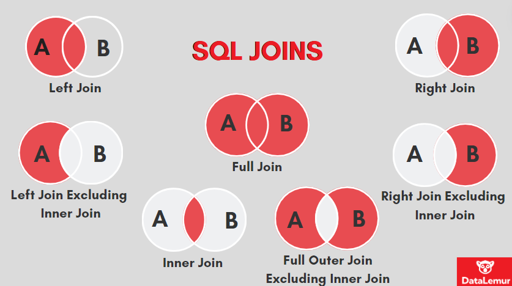

Joins!
======

Because data is often intentionally separated into different data sets in databases,
we often have to put it back together, but in fact, sometimes we are putting together
data from entirely different sources or data sets, and in that case we need to
do joins regardless.

Joins work like this:

Compare some subset of values from each data frame - these are the "keys" since
they determine which rows go together. Then we collect together the columns
from each data set when the keys match. 

Simple! But we need to decide a few things about what to do about missing data and this leads to different joins.

1. "left" table is literally the table we start with and is on our left
2. "right" table is the table we are working with and is our our right sytactically


Remember our actual data sets:

:schema:source_data::

First perhaps the most obvious sort of thing. We want to combine students
with their majors and we want to know which students may not yet have chosen
a major. This is called a "left" join because we keep everything in the left
table and fill in NA's if we don't have data in the right table. 
```R 
library(tidyverse)

students <- read_csv("source_data/student.csv")
majors <- read_csv("source_data/major.csv")
fraternities <- read_csv("source_data/fraternity.csv")
addresses <- read_csv("source_data/address.csv")
props <- read_csv("source_data/student_properties.csv")

# LEFT JOIN: keep all students, attach majors when present
mdpre(paste(
  "students:", nrow(students),
  "majors:", nrow(majors)
))
students_majors_left <- students %>%
  left_join(majors %>% rename(major_name = name, major_address_id = address_id),
            by = c("major_id" = "id")) %>%
  select(id, name, major_id, major_name, enrollment_date, gpa)

mdpre(paste("left join rows:", nrow(students_majors_left)))
mddf(students_majors_left)
```
Inner (contrived)
-----------------

Sometimes the most direct way to see what an inner join does is with a tiny example.

```R 
library(tidyverse) 

# CONTRIVED INNER JOIN: only rows with matching keys survive
left_df <- tibble(id = c(1, 2, 3), val_left = c("A", "B", "C"))
right_df <- tibble(id = c(2, 3, 4), val_right = c("X", "Y", "Z"))

mdpre("left")
mddf(left_df)

mdpre("right")
mddf(right_df)

mdpre(paste(
  "left rows:", nrow(left_df),
  "right rows:", nrow(right_df)
))

inner_df <- left_df %>% inner_join(right_df, by = "id")

mdpre(paste("inner rows:", nrow(inner_df)))
mddf("inner join")
mddf(inner_df)
```

Right and full
--------------

```R 
library(tidyverse)

students <- read_csv("source_data/student.csv")
majors <- read_csv("source_data/major.csv")
fraternities <- read_csv("source_data/fraternity.csv")
addresses <- read_csv("source_data/address.csv")
props <- read_csv("source_data/student_properties.csv")

# RIGHT JOIN: keep all properties, even if there is no matching student
mdpre(paste(
  "students:", nrow(students),
  "properties:", nrow(props)
))
props_right <- students %>%
  right_join(props, by = c("id" = "student_id"))

# Row count after right join
mdpre(paste("right join rows:", nrow(props_right)))

# Observe the intentionally dangling properties with student_id = 99
mddf(props_right %>% filter(is.na(name)))

# FULL JOIN: keep all students and all properties
props_full <- students %>%
  full_join(props, by = c("id" = "student_id"))

mdpre(paste("full join rows:", nrow(props_full)))
mddf(props_full)
```

Semi and anti
-------------

```R 
# SEMI JOIN: which students have at least one property row?
mdpre(paste("students:", nrow(students)))
has_props <- students %>% semi_join(props, by = c("id" = "student_id"))

# ANTI JOIN: which students have no properties? (may be empty)
no_props <- students %>% anti_join(props, by = c("id" = "student_id"))

mdpre(paste(
  "with props:", nrow(has_props),
  "without props:", nrow(no_props)
))
mddf(has_props)
mddf(no_props)
```

Joining lookups
---------------

```R 
# Join fraternities to their address; note missing address for one fraternity
mdpre(paste(
  "fraternities:", nrow(fraternities),
  "addresses:", nrow(addresses)
))
frats_with_addresses <- fraternities %>%
  left_join(addresses %>% rename(
    frat_street = line1, frat_city = city, frat_state = state
  ), by = c("address_id" = "id"))

mdpre(paste("frat left join rows:", nrow(frats_with_addresses)))
mddf(frats_with_addresses)

# Join students to their own address; note a missing student address_id
mdpre(paste(
  "students:", nrow(students),
  "addresses:", nrow(addresses)
))
students_with_address <- students %>%
  left_join(addresses %>% rename(
    student_street = line1, student_city = city, student_state = state
  ), by = c("address_id" = "id"))

mdpre(paste("student left join rows:", nrow(students_with_address)))
mddf(students_with_address)
```

Chaining joins
--------------

```R 
# Build a richer table by chaining left joins to keep all students
mdpre(paste("students:", nrow(students)))
student_profile <- students %>%
  left_join(majors %>% rename(major_name = name, major_address_id = address_id),
            by = c("major_id" = "id")) %>%
  left_join(fraternities %>% rename(frat_name = name, frat_address_id = address_id),
            by = c("fraternity_id" = "id")) %>%
  left_join(addresses %>% rename(
    student_street = line1, student_city = city, student_state = state
  ), by = c("address_id" = "id")) %>%
  left_join(addresses %>% rename(
    major_street = line1, major_city = city, major_state = state
  ), by = c("major_address_id" = "id")) %>%
  left_join(addresses %>% rename(
    frat_street = line1, frat_city = city, frat_state = state
  ), by = c("frat_address_id" = "id")) %>%
  select(
    id, name, major_name, frat_name,
    student_street, student_city,
    major_street, major_city,
    frat_street, frat_city
  )

mdpre(paste("profile rows:", nrow(student_profile)))
mddf(student_profile)
```
