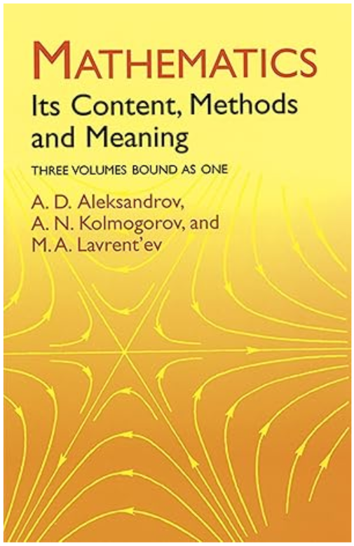

Discreteness, Continuity, Smoothness, Mathematical Structure, Philosophy
========================================================================



:student-select:Which is primary, numbers or the universe?; ../students.json::

I've decided to stop and discuss tabular data before we get too into visualization
because we need to manipulate data in order to plot it and we need to have a basic
idea of how we do that in R before we overload our brains with trying to understand
visualization.

You might know that if we attempt to formalize mathematics we run into all sorts
of strange issues relating to infinities, continuity, etc. What is at least
partly interesting about this is that when we collect data we always collect
a finite amount of it and in discrete chunks. Any data we might care to analyze
is countably finite. 

```sidebar 
Even weirder than that: our mathematical systems contain all sorts of strange
types of infinities of increasingly mind-boggling character but as far as I know
we only ever need complex spaces of the same cardinality as the real numbers
to do physics - why the paucity?
```

Anyway, lucky for us, data is always finite and countable and that means even
things like continuous functions (eg, voltage traces) are represented by a finite
number of samples and that means (in principle) every data set is a table.

Relational Data
===============

In keeping with the thematics of data science being related to the incidental
production of data, it's important for us to understand a little bit of why
tabular data is organized the way it is when we get it. 


:table:source_data/frat_boys_basic.csv::

Consider the above table. 

It is the kind of thing we might like to get if we are a data scientist. But 
if someone asks you to check out a database for them you might instead 
get all the data above broken up into multiple tables.

student, fraternity, address, major

Like this:

:table:source_data/student.csv::
:table:source_data/address.csv::
:table:source_data/fraternity.csv::
:table:source_data/major.csv::


This can seem perverse to the data scientist - why put everything all over the
place like this?

The answer is that it's hard to maintain databases and you want to have each
piece of data only stored once and in one place.

So half of what we need to do is learn to put data back together when it's all
split up like this. This leads us to think about ::joins:joins and pivots::.
